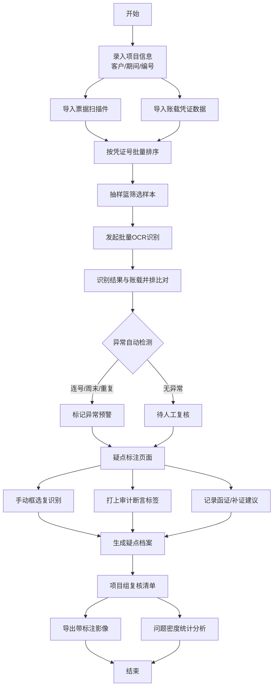

## 1. 产品概述

面向会计师事务所审计项目组的纯前端纸票影像识别验真工作台，用于现场抽凭时快速判断客户原始票据是否存在明显疑点，实现"看影像、抓异常、留底稿"三大核心目标。

- **核心价值**：提升审计现场抽凭效率，自动识别票据异常风险，标准化审计底稿留存
- **目标用户**：会计师事务所审计项目经理、现场审计人员、项目复核人员
- **使用场景**：客户现场审计、凭证抽查、票据真伪初步核验、审计底稿编制

## 2. 核心功能

### 2.1 用户角色

| 角色 | 说明 | 核心权限 |
|------|------|----------|
| 现场审计人员 | 项目组执行层 | 样本导入、识别操作、疑点标注 |
| 项目经理 | 项目负责人 | 复核审计底稿、导出报告、统计分析 |

### 2.2 功能模块

1. **样本导入页**：离线导入票据扫描件、批量上传、按凭证号排序、客户/期间信息录入
2. **抽样篮**：样本列表管理、筛选过滤、批量选择、抽样状态追踪
3. **识别比对页**：OCR自动识别票面核心字段、与账载数据并排比对、异常智能检测
4. **疑点标注页**：影像区域手动框选复识别、审计断言标签、函证/补证建议记录
5. **审计底稿页**：项目组内部复核清单、带标注图片导出、问题密度统计分析

### 2.3 页面详情

| 页面名称 | 模块名称 | 功能描述 |
|---------|---------|----------|
| 样本导入页 | 项目信息录入 | 客户名称、审计期间、项目编号输入 |
| 样本导入页 | 文件上传区 | 拖拽/点击批量上传图片、PDF扫描件 |
| 样本导入页 | 凭证排序 | 按凭证号自动排序、手动拖拽调整顺序 |
| 样本导入页 | 账载数据导入 | 导入账载凭证Excel（凭证号、摘要、金额、日期） |
| 抽样篮 | 样本列表 | 卡片式展示所有票据样本及状态 |
| 抽样篮 | 筛选过滤 | 按凭证号、日期、金额、识别状态筛选 |
| 抽样篮 | 批量操作 | 批量标记、批量删除、批量识别 |
| 识别比对页 | 影像查看器 | 票据影像展示、缩放、旋转、镜像翻转 |
| 识别比对页 | OCR识别结果 | 发票号码、开票日期、金额、税额、销售方等字段 |
| 识别比对页 | 并排比对 | 左：影像+OCR结果 | 右：账载数据 | 差异高亮 |
| 识别比对页 | 异常检测 | 连号集中报销检测、周末异常开票、重复入账风险 |
| 疑点标注页 | 区域框选 | 鼠标拖拽框选影像模糊区域、手动复识别 |
| 疑点标注页 | 断言标签 | 真实性异常、完整性异常、准确性异常、截止异常标签 |
| 疑点标注页 | 建议记录 | 函证建议、补充证据建议、审计调整建议 |
| 疑点标注页 | 疑点列表 | 所有疑点汇总列表、快速跳转定位 |
| 审计底稿页 | 复核清单 | 项目组内部复核项清单、复核人签字 |
| 审计底稿页 | 导出功能 | 带标注影像导出、疑点摘要PDF/图片包 |
| 审计底稿页 | 统计看板 | 按客户、期间的问题密度热力图、分类统计 |

## 3. 核心流程

### 3.1 主工作流程

1. 审计人员进入系统，录入项目基本信息（客户、期间、项目编号）
2. 批量导入票据扫描件和账载凭证数据，系统按凭证号自动排序
3. 审计人员在抽样篮中筛选待查凭证，批量发起识别
4. 系统OCR识别票面核心字段，自动与账载数据比对并标记差异
5. 智能检测连号报销、周末开票、重复入账等异常模式
6. 审计人员对模糊区域手动框选复识别，给疑点打上审计断言标签
7. 记录函证或补证建议，形成完整疑点档案
8. 生成项目组复核清单，导出带标注的影像摘要和统计报告

### 3.2 流程图

## 4. 用户界面设计

### 4.1 设计风格

- **主色调**：专业深蓝 (#1e3a5f) 作为主色，搭配沉稳墨绿 (#2d5a3d) 作为通过状态，警示橙红 (#c44536) 作为异常标记，中性灰 (#4a5568) 作为辅助色
- **辅助色**：纸质米白背景 (#faf8f5)，营造审计工作底稿的专业纸质感
- **按钮风格**：直角微圆角（4px）、实心按钮配描边、按压有下沉反馈
- **字体**：标题使用 Noto Serif SC（衬线体，专业感），正文使用 JetBrains Mono + Noto Sans SC 等宽混合（便于数字比对）
- **布局风格**：模块化卡片布局、顶部导航 + 左侧状态面板 + 中央工作区的三栏式专业工具布局
- **图标风格**：Lucide 线性图标，统一 2px 线宽，偏审计专业领域

### 4.2 页面设计概要

| 页面名称 | 模块名称 | UI 元素与风格 |
|---------|---------|-------------|
| 全局 | 顶部导航栏 | 深蓝底白字、左侧Logo区、中部5个步骤指示器（带完成状态）、右侧项目信息快显 |
| 样本导入页 | 文件上传区 | 虚线边框米白底上传区域、支持拖拽高亮、文件列表带缩略图预览、进度条 |
| 样本导入页 | 排序表格 | 斑马纹表格、凭证号可编辑输入框、拖拽排序抓手图标 |
| 抽样篮 | 样本卡片 | 卡片悬浮阴影、状态徽章（已识别/待识别/有疑点）、金额右对齐等宽字体 |
| 抽样篮 | 筛选栏 | 组合下拉筛选器、日期范围选择器、金额区间滑块 |
| 识别比对页 | 工作区布局 | 左右双栏50:50分屏、中间可拖拽分隔条、顶部工具栏 |
| 识别比对页 | 差异高亮 | 背景色高亮差异项（红底/黄底）、差异箭头指示器、差异百分比 |
| 识别比对页 | 异常检测卡 | 顶部横向滚动异常卡、卡片带警示图标、点击跳转定位 |
| 疑点标注页 | 影像画布 | Canvas覆盖层、可拖拽调整大小的半透明选框、选框带标注编号 |
| 疑点标注页 | 断言标签 | 圆角标签按钮、不同类型不同配色、可多选、可自定义备注 |
| 疑点标注页 | 建议输入区 | 富文本编辑框、预设建议模板快速插入 |
| 审计底稿页 | 复核清单 | 树形复选列表、含复核项、复核结论、复核人签字区 |
| 审计底稿页 | 统计看板 | 问题密度热力图（按月份×凭证类型）、分类统计环形图、异常趋势折线 |
| 审计底稿页 | 导出栏 | 固定底部操作栏、多格式导出选项、带导出进度反馈 |

### 4.3 响应式设计

- **桌面优先**：以 1440px 宽度为主要设计基准，适配审计现场常用笔记本屏幕
- **宽屏优化**：1920px 以上宽度自动增加内容区留白，提升并排比对体验
- **触控优化**：关键操作按钮最小尺寸 44×44px，支持触屏设备现场使用
- **打印适配**：审计底稿页提供打印优化样式，可直接输出纸质复核清单

### 4.4 动画与交互

- **页面切换**：步骤指示器间的平滑过渡动画，当前步骤高亮发光
- **识别过程**：OCR识别时显示扫描线动画，模拟真实识别过程
- **差异发现**：差异项出现时带轻微闪烁高亮，引导审计人员注意
- **框选操作**：鼠标拖拽时实时虚线预览，松开后弹性缩放至最终大小
- **数据加载**：表格/卡片骨架屏加载动画，避免空白等待
- **悬停反馈**：卡片/按钮悬停时边框色渐变 + 微上移效果
