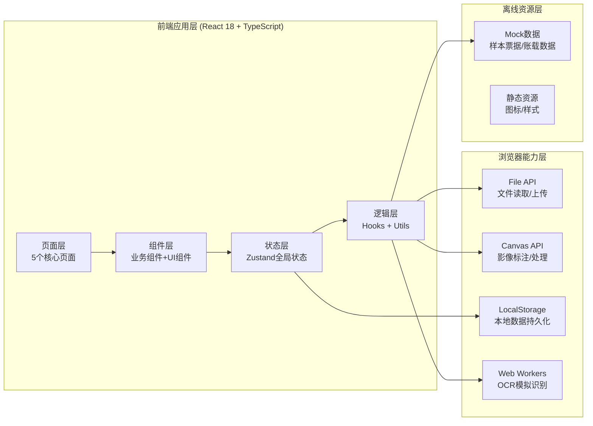
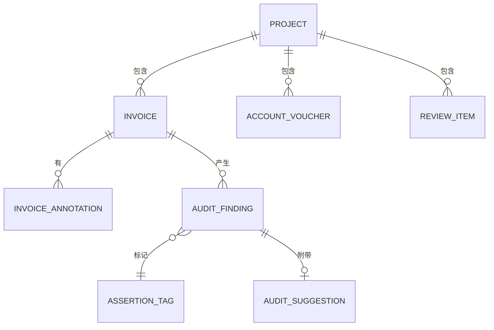
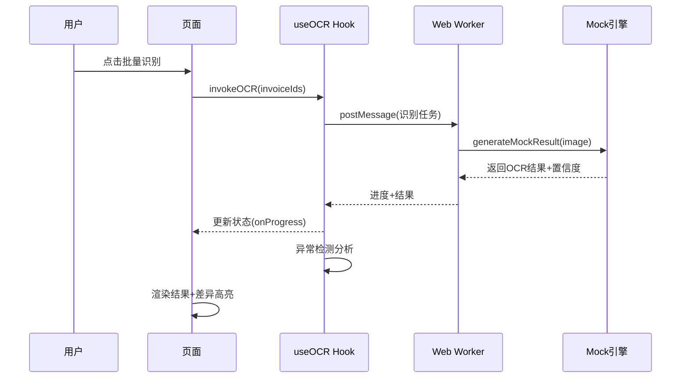

## 1. 架构设计



## 2. 技术描述

- **前端框架**：React@18 + TypeScript@5
- **构建工具**：Vite@5
- **样式方案**：Tailwind CSS@3 + CSS变量主题系统
- **状态管理**：Zustand（轻量级状态管理，支持分模块）
- **路由方案**：React Router DOM@6（Hash路由，纯前端适配）
- **图标库**：Lucide React（专业线性图标）
- **图表库**：Recharts（问题密度统计图表）
- **文件处理**：本地 FileReader API，纯前端处理无后端
- **数据持久化**：LocalStorage 自动保存项目状态
- **OCR识别**：前端模拟OCR引擎（含扫描动画、随机识别置信度）
- **纯前端特性**：零后端依赖，支持完全离线使用

## 3. 路由定义

| 路由路径 | 页面名称 | 核心功能 |
|---------|---------|---------|
| `/import` | 样本导入页 | 项目信息录入、票据上传、排序、账载导入 |
| `/sample` | 抽样篮 | 样本列表、筛选、批量操作、状态管理 |
| `/compare` | 识别比对页 | OCR识别、并排比对、异常检测 |
| `/mark` | 疑点标注页 | 区域框选、断言标签、建议记录 |
| `/workpaper` | 审计底稿页 | 复核清单、导出、统计分析 |

## 4. 核心数据模型

### 4.1 数据关系图



### 4.2 数据模型定义

```typescript
// 项目信息
interface Project {
  id: string;
  clientName: string;           // 客户名称
  projectCode: string;          // 项目编号
  periodStart: string;          // 审计期间开始
  periodEnd: string;            // 审计期间结束
  auditor: string;              // 审计人员
  createTime: string;
}

// 票据影像样本
interface Invoice {
  id: string;
  projectId: string;
  voucherNo: string;            // 凭证号
  imageUrl: string;             // 影像Base64/URL
  fileName: string;
  uploadTime: string;
  status: 'pending' | 'recognizing' | 'recognized' | 'doubt' | 'confirmed';
  
  // OCR识别结果
  ocrResult?: OcrResult;
  recognitionConfidence?: number;  // 识别置信度
  
  // 关联账载数据
  accountVoucherId?: string;
}

// OCR识别结果
interface OcrResult {
  invoiceNo: string;            // 发票号码
  invoiceCode: string;          // 发票代码
  invoiceDate: string;          // 开票日期
  amount: number;               // 含税金额
  taxAmount: number;            // 税额
  priceAmount: number;          // 不含税金额
  sellerName: string;           // 销售方名称
  sellerTaxNo: string;          // 销售方税号
  buyerName: string;            // 购买方名称
  summary: string;              // 货物/服务摘要
  remark: string;               // 备注
}

// 账载凭证
interface AccountVoucher {
  id: string;
  projectId: string;
  voucherNo: string;            // 凭证号
  voucherDate: string;          // 凭证日期
  summary: string;              // 账载摘要
  amount: number;               // 账载金额
  accountCode: string;          // 科目代码
  accountName: string;          // 科目名称
}

// 比对差异
interface CompareDiff {
  field: string;
  ocrValue: string;
  accountValue: string;
  diffType: 'amount' | 'date' | 'summary' | 'other';
  diffLevel: 'warning' | 'critical' | 'minor';
}

// 异常检测
interface Anomaly {
  id: string;
  invoiceId: string;
  type: 'consecutive_no' | 'weekend' | 'duplicate' | 'round_amount' | 'amount_mismatch';
  level: 'high' | 'medium' | 'low';
  description: string;
  relatedInvoices?: string[];   // 关联票据ID
}

// 影像标注框
interface InvoiceAnnotation {
  id: string;
  invoiceId: string;
  x: number;
  y: number;
  width: number;
  height: number;
  label: string;
  ocrReread?: string;           // 复识别结果
  createTime: string;
}

// 审计断言标签
type AssertionType = 'existence' | 'completeness' | 'accuracy' | 'cutoff' | 'classification';

interface AssertionTag {
  type: AssertionType;
  label: string;
  color: string;
}

// 审计疑点
interface AuditFinding {
  id: string;
  invoiceId: string;
  title: string;
  description: string;
  assertions: AssertionType[];
  annotationIds: string[];
  suggestion?: AuditSuggestion;
  createTime: string;
  createBy: string;
}

// 审计建议
interface AuditSuggestion {
  type: 'confirmation' | 'supplement' | 'adjustment' | 'note';
  content: string;
  responsible: string;
  deadline?: string;
  status: 'pending' | 'in_progress' | 'completed';
}

// 复核清单
interface ReviewItem {
  id: string;
  projectId: string;
  category: string;
  content: string;
  conclusion: 'pass' | 'fail' | 'pending';
  reviewer?: string;
  reviewTime?: string;
  remark?: string;
}
```

## 5. 目录结构

```
src/
├── components/                # 可复用组件
│   ├── layout/               # 布局组件
│   │   ├── TopNav.tsx        # 顶部导航+步骤指示器
│   │   └── SidePanel.tsx     # 侧边状态面板
│   ├── common/               # 通用UI组件
│   │   ├── StatusBadge.tsx
│   │   ├── StepIndicator.tsx
│   │   └── DataCard.tsx
│   ├── invoice/              # 票据相关组件
│   │   ├── ImageViewer.tsx   # 影像查看器
│   │   ├── AnnotationCanvas.tsx # 标注画布
│   │   └── InvoiceCard.tsx
│   └── chart/                # 图表组件
│       ├── DensityHeatmap.tsx
│       └── AnomalyPieChart.tsx
├── pages/                    # 页面组件
│   ├── ImportPage.tsx
│   ├── SampleBasketPage.tsx
│   ├── ComparePage.tsx
│   ├── MarkPage.tsx
│   └── WorkpaperPage.tsx
├── store/                    # Zustand状态管理
│   ├── projectStore.ts       # 项目状态
│   ├── invoiceStore.ts       # 票据状态
│   └── findingStore.ts       # 疑点状态
├── hooks/                    # 自定义Hooks
│   ├── useFileUpload.ts
│   ├── useOCR.ts
│   ├── useAnomaly.ts
│   └── useExport.ts
├── utils/                    # 工具函数
│   ├── ocrEngine.ts          # OCR模拟引擎
│   ├── anomalyDetector.ts    # 异常检测算法
│   ├── imageProcessor.ts     # 图像处理
│   └── mockData.ts           # Mock数据生成器
├── types/                    # TypeScript类型定义
│   └── index.ts
├── styles/                   # 全局样式
│   └── theme.css
├── App.tsx
├── main.tsx
└── router.tsx
```

## 6. 核心算法与逻辑

### 6.1 异常检测算法

1. **连号集中报销检测**：按销售方+日期分组，检测发票号码区间连续且张数≥3的组
2. **周末异常开票**：检测开票日期为周六/周日的发票
3. **重复入账风险**：基于发票代码+号码+金额的哈希值去重检测
4. **整数金额异常**：检测金额为整千、整万且占比过高的报销
5. **金额差异检测**：OCR识别金额与账载金额偏差超过阈值（±1%或±100元）

### 6.2 OCR识别流程



### 6.3 导出功能实现

1. **带标注影像导出**：使用Canvas合成原图像+标注框+疑点标签，导出为PNG
2. **疑点摘要导出**：使用纯前端JSZip打包，生成图片包+JSON/CSV清单
3. **复核清单导出**：生成可打印的HTML，支持浏览器原生打印为PDF

## 7. 前端状态管理分片

```typescript
// projectStore - 项目基本信息
// invoiceStore - 票据/账载/识别/异常数据
// findingStore - 疑点/标注/建议/复核
```
